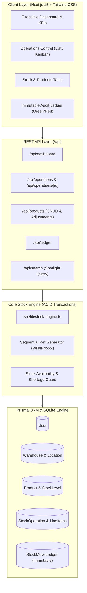

# StockSense IMS — Modular Inventory Management System
> **Odoo x LPU Jalandhar Hackathon 2026 Submission**  
> **Team Lead**: Dakshvir Sharma (`dakshvirsharma-hub`)  
> **Evaluator Collaborator**: K Theja (`kthe-odoo`, `kthe@odoo.com`)  
> **Repository**: [https://github.com/dakshvirsharma-hub/odoo-hackathon2026](https://github.com/dakshvirsharma-hub/odoo-hackathon2026)  
> **Live Production Demo**: [https://odoo-hackathonbydaksh.vercel.app](https://odoo-hackathonbydaksh.vercel.app)

---

## 🌟 Executive Summary

**StockSense** is a high-performance, modular Inventory Management System (IMS) engineered to replace fragile paper registers and spreadsheets with real-time, double-entry stock digitization. Built on Next.js 15, Prisma, and SQLite, it models stock transfers as balanced movements between physical locations (`WH/Stock1`, `WH/Production`) and virtual counterparties (`Partner/Vendors`, `Partner/Customers`, `Virtual/Scrap`).

---

## 🏗️ System Architecture & Data Flow



---

## ⚙️ Core Engineering Features

1. **Double-Entry Inventory Accounting (The Odoo Way)**:
   - **Receipt (`IN`)**: Stock moves from `Partner/Vendors` $\rightarrow$ `WH/Stock1` (+Stock).
   - **Delivery (`OUT`)**: Stock moves from `WH/Stock1` $\rightarrow$ `Partner/Customers` (-Stock).
   - **Internal Transfer**: Stock moves between internal racks (`WH/Stock1` $\rightarrow$ `WH/Production`).
   - **Adjustment**: Discrepancies between physical counts and system balances are reconciled against `Virtual/Scrap`.
2. **Shortage Protection & Waiting Queue**:
   - Deliveries verify `Free to Use` stock (`onHand - reserved`) before validation. If inventory is insufficient, the system marks the line item red, transitions the order to `WAITING`, and halts dispatch.
3. **Dual List & Kanban Views**:
   - Operations and Move History screens support one-click switching between tabular data grids and status-grouped Kanban cards (`Draft`, `Waiting`, `Ready`, `Done`).
4. **Spotlight Search**:
   - Universal search endpoint querying products, operations, contacts, and warehouse locations in parallel.
5. **Color-Coded Move History**:
   - Incoming movements tagged in **Green (`+Qty`)** and outgoing movements tagged in **Red (`-Qty`)**.

---

## ⚡ 60-Second Quick Start (For Evaluators)

### 1. Clone & Install Dependencies
```bash
git clone https://github.com/dakshvirsharma-hub/odoo-hackathon2026.git
cd odoo-hackathon2026
npm install
```

### 2. Initialize Database & Realistic Seed Data
```bash
npx prisma db push
npm run seed
```
*Seeds 14 realistic products (Desks, Tables, Chairs, Steel Rods, Screws), 2 warehouses, 6 locations, and historical documents.*

### 3. Run Automated Smoke Test Suite
```bash
npm test
```
*Executes automated end-to-end tests verifying database connectivity, sequential reference generation, atomic double-entry balance updates, and shortage blocking.*

### 4. Launch Development Server
```bash
npm run dev
```
Open **[http://localhost:3000](http://localhost:3000)** in your browser.

---

## 🔑 Pre-Seeded Demo Credentials

| Role | Login ID | Email | Password |
| :--- | :--- | :--- | :--- |
| **Inventory Manager** | `dakshvir` | `dakshvirsharma2008@gmail.com` | `OdooHack2026!` |
| **Warehouse Staff** | `staff_alex` | `alex@stocksense.internal` | `OdooHack2026!` |

---

## 🧪 Automated Test Verification

StockSense includes an integrated smoke test runner (`scripts/smoke-test.ts`):
- **Test 1**: Verifies database connection & 14 realistic seed products.
- **Test 2**: Asserts sequential reference generation (`WH/IN/0001`).
- **Test 3**: Asserts atomic stock increment and double-entry ledger write.
- **Test 4**: Proves delivery shortage detection blocks dispatch and flags orders in `WAITING` state.

---

